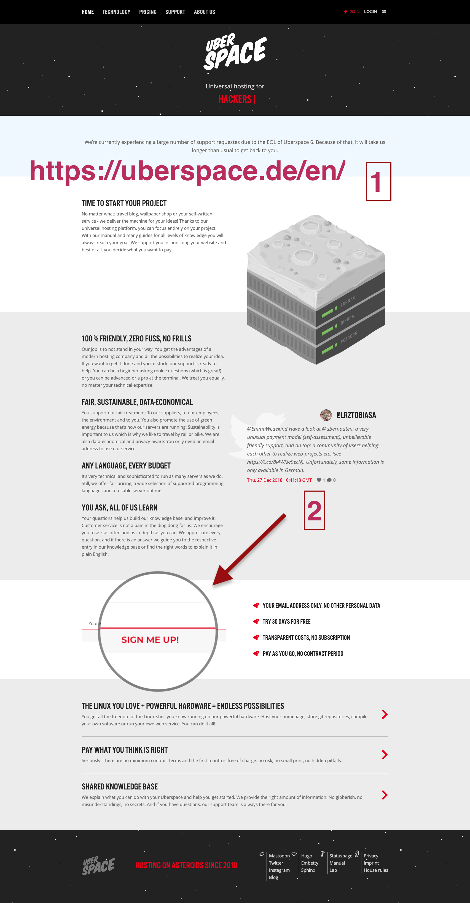
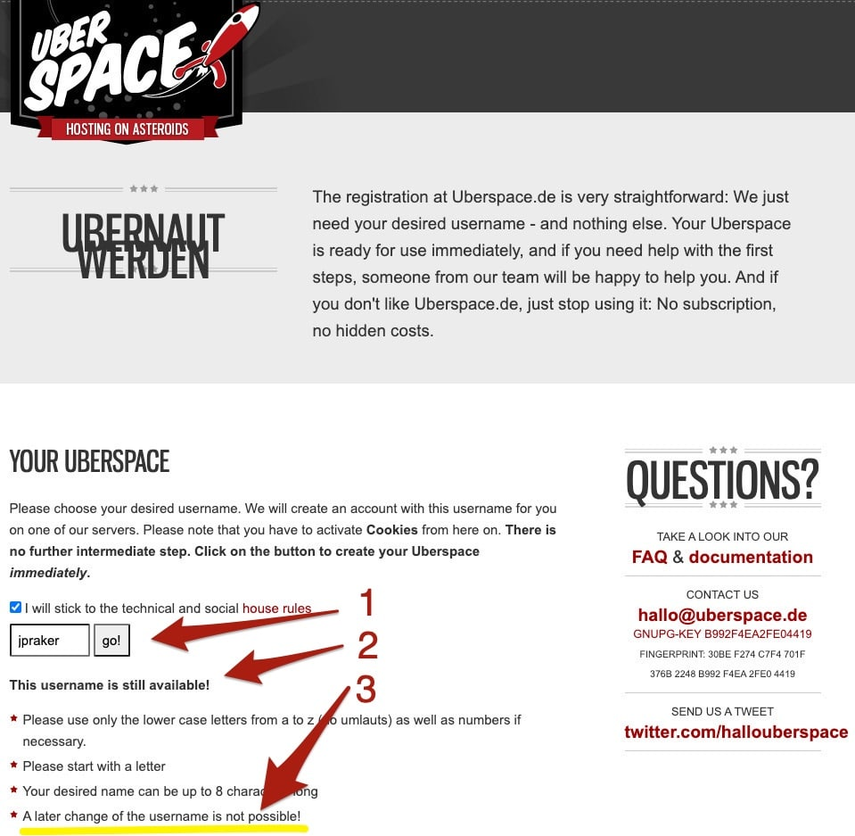
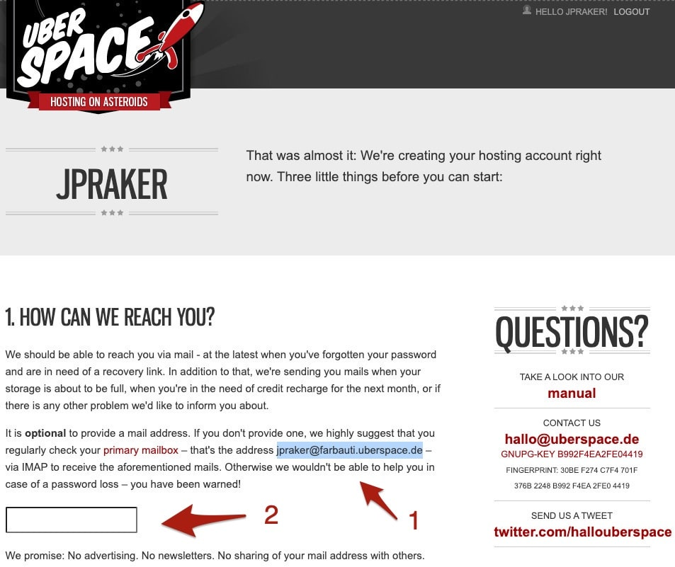
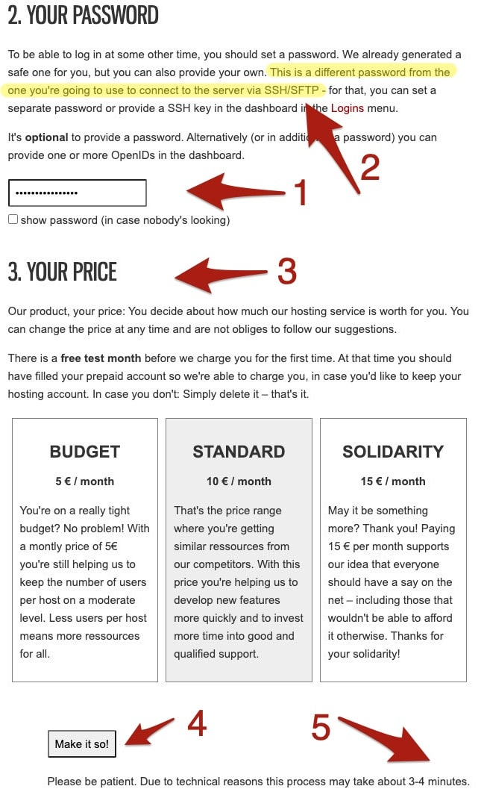
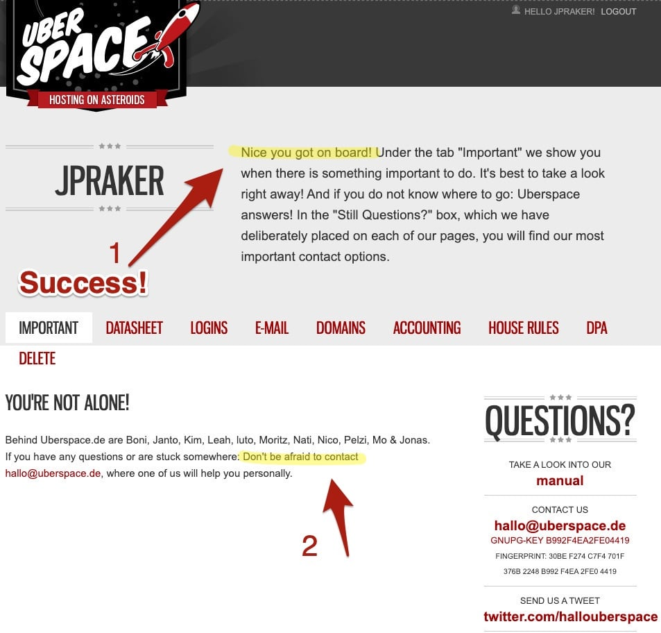
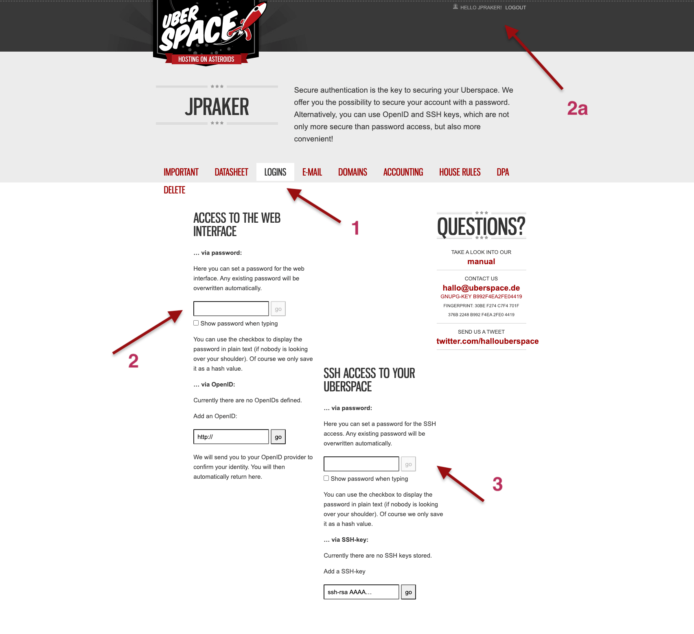

With this article, I begin a new series of step-by-step instructions focused on installing and working with open source tools on your own server space. I've learned some of these procedures participating as an audience member in a sequence of German web talks by [Guido Brombrach](https://www.oercamp.de/webinare/ostools/), organized by [OERcamp](https://www.oercamp.de/).

## Step 1: Go to the URL of your hosting service

 <figcaption>**Step 1:** Go to the URL of Uberspace and scroll to the middle of the start page.</figcaption>

1.  Go to the start page of your hosting service. This tutorial uses [Uberspace](https://uberspace.de/en/).
2.  Scroll to the middle of the page and click on the link SIGN ME UP!

------------------------------------------------------------------------

## Step 2: Provide your username

 <figcaption>**Step 2:** Choose username and fill it in the form of the Uberspace registration page.</figcaption>

1.  Think again about your chosen username. You can't change it anymore. It will be the first part of the URL, followed by the server address.
2.  Fill in your username and tick the check box to conform to the technical and social house rules.
3.  Check if your username is still available.

------------------------------------------------------------------------

## Step 3: Provide your email address (to reset your password)

 <figcaption>**Step 3:** After creating your account Uberspace asks for additional information. First part: eMail.</figcaption>

Uberspace comes back after some moment with this new form. Meanwhile, the program has stored your username in the Uberspace database and already logged you in. What you here see is the first part of the form.

1.  Also, you have already gotten an email address.
2.  But for security reasons, I recommend providing another email address. Whenever you forgot your password, you can apply for a new password sent to your email account. Otherwise, you are locked out from your webspace.

------------------------------------------------------------------------

## Step 4: Set your password and choose your price model

 <figcaption>**Step 4:** Uberspace asking for additional information. Second part: Password and price.</figcaption>

After scrolling down, you will see this second part of the form.

1.  Provide a password to enter later the admin pages of your webspace.
2.  This password has nothing to do with the password you will use to access the server via SSH or SFTP. (I will explain **S**ecure **Sh**ell resp. **S**ecure **F**ile **T**ransfer **P**rotocol in another tutorial.)
3.  Uberspace has an exciting price model. The first month is free in any case. After that, you have three paying options. All of them have the same services but differ in your financial contribution to the hosting service. You can always later change your decision.
4.  Then click the "Make it so" button.
5.  Be patient. It can take several minutes till your server space is ready for you to access.

------------------------------------------------------------------------

## Step 5: Success of web registration!

 <figcaption>**Step 5:** Success page of the web registration process.</figcaption>

1.  When you see this page, your registration process was successful. Congrats!
2.  There are many helpful resources in the Uberspace [manual](https://manual.uberspace.de/) and [wiki](https://wiki.uberspace.de/). But if you are still stuck, don't be shy and ask the people at Uberspace directly via [email](hallo@uberspace.de).

------------------------------------------------------------------------

## Step 6: Password for SSH access

 <figcaption>**Step 6:** Uberspace start page after logged in.</figcaption>

1.  The successful registration for web access only means that you can now enter your uberspace web admin page. To get the page you see on the screenshot, you have to login into Uberspace and open the tab "Logins."

2.  On the left side, you see your login for the Uberspace admin page (your web access). If you want, you can provide another password that will override your old one. As you can see, under 2a, I am already logged in.

3.  What we need to do now is to provide a password for access to your server space. When you fill in this (different) password, you will get a red bar on top of the screen saying you have set an SSH password. With this password, you can now access your server with an FTP-client or via your terminal.

