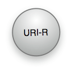

## Research with archived web data

In a [previous article](/2019/07/22/archiving-quoted-web-resources/), I wrote about the possibilities of the [Wayback Machine](https://archive.org/web/) for scientific writing. I argued that archiving web pages are essential for references as they prevent link rots when cited web resources are not available anymore. With this blog entry, I am looking into the reverse option: Finding and retrieving archived web pages for research reasons.

Archived web pages as permanently stored data are indispensable for reproducibility issues. But they are also valuable research resources as they are data for historical and comparative research.

This article rewrites my blog entry from 2019 on [Scraping Archived Data with the Wayback Machine](/2019/08/01/scraping-archived-data-with-the-wayback-machine) in three aspects:

1.  I am going into more detail to explain the Memento Protocol that stands behind the archiving procedures of the Internet Archive with the Wayback Machine.
2.  I will demonstrate the research significance of archived data with another --- more simple --- example. Instead, to analyze yearly differences in the ranking of the popularity of static site generators, I will focus on the number of statistical packages developed by the R community over time. The website structure for static site generators is complex, has changed several times, and contradicts the demonstration purpose.[^1]
3.  To argue the importance of archived data convincingly, it is necessary to extract the URLs of archived data and use these data for research issues. Therefore, I will show how R can scrape web data and display the data for further analysis.

## How does the Memento API work? {#how-does-the-memento-api-work}

Mementos are prior versions of web pages cached by web crawlers and stored in web archives. The HTTP-based Memento framework is a [description for Time-Based Access to Resource States](https://mementoweb.org/guide/rfc/).

With Mementos, you can access a version of a Web resource as it existed at some date in the past. The complete information about the [Memento Project](http://mementoweb.org/about/) is specified in RFC 7089 as [HTTP Framework for Time-Based Access to Resource States -- Memento](http://mementoweb.org/guide/rfc/). I will explain the essential idea with the gentle [non-technical introduction](http://mementoweb.org/guide/quick-intro/) on the Memento website.

In the Memento protocol there are four important components:

**Original Resource (URI-R)**: A Web resource that exists or used to exist on the live Web for which we want to find a prior version.

**Memento (URI-M)**: A Web resource that is a prior version of the Original Resource. Prior versions are Web resources encapsulated in what the Original Resource was like at some time in the past.

**TimeGate (URI-G)**: A Web resource that "decides" on the basis of a given datetime, which Memento best matches what the Original Resource was like around that given datetime.

**TimeMap (URI-T)**: A list of URIs of Mementos of the Original Resource that is archived, e.g., available online.

The central component is the TimeMap Resource. It is a machine-readable document that lists the Original Resource itself, its TimeGate, and its Mementos, as well as associated metadata such as archival DateTime for Mementos.

> The HTTP-based Memento framework bridges the present and past Web. It facilitates obtaining representations of prior states of a given resource by introducing datetime negotiation and TimeMaps. Datetime negotiation is a variation on content negotiation that leverages the given resource's URI and a user agent's preferred datetime. TimeMaps are lists that enumerate URIs of resources that encapsulate prior states of the given resource. (Quoted from [RFC 7089](http://mementoweb.org/guide/rfc/))

```{=html}

```
## Where to find the desired information?

To demonstrate the interplay of the Memento protocol with the Wayback Machine, I will look into the history of the R project web page. I want to know the number of available packages over time.

There are three web pages where I can find out the number of available packages:

### Contributed Packages

[Contributed Packages](https://cran.r-project.org/web/packages/index.html): On this page is the number of available packages written directly under the subheading "Available Packages".

```{=html}

```
### Packages By Name

[Available CRAN Packages By Name](https://cran.r-project.org/web/packages/available_packages_by_name.html): This page list all packages alphabetically. One could count the lines with the package's name to get the desired number.

```{=html}

```
### Packages By Date of Publication

[Available CRAN Packages By Date of Publication](https://cran.r-project.org/web/packages/available_packages_by_date.html): This page list all packages by date of publication. Here one could also count the lines with the package's dates to get the desired number.

```{=html}

```
## Which page to scrape?

The question now arises if these pages are also available in the past. And if so: Have they the same structure to use the identical CSS selector in all archived instances?

The question now arises if this page is available also in the past. And if so: Has it the same structure to use the identical CSS selector in all prior archived instances?

### Contributed Packages

It turns out that the first line after the subheading could be scraped with the CSS selector `#pkgs + p`.

```{=html}

```
```{=html}

```
To check if the website structure for the paragraph after the header with id = "pkgs" remains constant, we can use the browser plugin for the Wayback Machine (available for [Google Chrome](https://chrome.google.com/webstore/detail/wayback-machine/fpnmgdkabkmnadcjpehmlllkndpkmiak?hl=en&gl=US) and [Firefox.](https://addons.mozilla.org/en-US/firefox/addon/wayback-machine_new/)).

```{=html}

```
If you click on the Wayback Machine plugin, you can either go directly to the first or last (recent) snapshot of this web page. I choose "Overview" to display the calendar to inspect different instances of the archived page.

```{=html}

```
The calendar shows that the page was between May 14, 2008, and April 13, 2021, 145 times archived. From this overview page, one can select different instances and content and design of the 'Contributed Packages' page. To get an idea of possible changes in the structure, I start with the first instance of the archived page.

{} The number of times the page was crawled by the Wayback Machine (in my example: 145) has nothing to do with how often the page was updated. {}

```{=html}

```
The archived page displays a different layout. The number of packages is not immediately after the first heading but after several paragraphs later (see number 2 in the image). Also, the name of the heading has changed from "Available Packages" to "Available Bundles and Packages". But more importantly: The paragraph following immediately of this header mentions the amounts of different kinds of packages and bundles. It would be challenging to detect the desired number (in this case, 1425 packages) programmatically.

A further inspection shows that the id still remains "pkgs". But because of the different text of the first paragraph, I want to look at another page to grab my desired information easier.

### Packages By Name

Here I will demonstrate the use of a helpful tool. The [Web scraping 101 vignettes](https://rvest.tidyverse.org/articles/rvest.html) of the `rvest` package references [SelectgorGadget](https://rvest.tidyverse.org/articles/articles/selectorgadget.html), a JavaScript bookmarklet to find out the required CSS selector interactively.

```{=html}

```
After selecting the first name, the SelectorGadget shows the CSS selector a, referring to all hyperlinks of this page. At the bottom, you can see that there are 17674 hyperlinks on this page. The problem is that the headline consists of the letters of the alphabet, which also are hyperlinks.

```{=html}

```
To select another position on the page with the SelectorGadget, subtracts these selected items. The bottom line shows the CSS selector with 'td a' (table data followed by a hyperlink) and removes the 26 characters to get 17648 selected objects. So this would be an easy way to get the number of available R packages.

The first archived page starts with September 24, 2011, and reduces, therefore, our survey period. But more important: From the 193 archived pages (more than the 145 instances of the 'Contributed Package' page!) are many redirects.

```{=html}

```
The size of the circles displays the number of pages crawled. Blue is directly archived, green is an archived page after a redirect. I could not find a solution to distinguish the difference between direct archiving and after a redirect programmatically. The problem with a redirect is that the same state of a page is archived several times but counts as different pages in time. This pollutes the resulting data set.

### Packages by Date of Publication

Finally, I decided to scrape the page "Packages by Date of Publication" with the simple CSS selector 'a'. It has the same period as the "Package By Name" page (the first instance is from September 26, 2011). It was archived only 81 times but with very few redirects.

```{=html}

```
## Memento protocol in action

### Package installation

At first, we have to install and load the [wayback package](https://github.com/hrbrmstr/wayback), a wonderful and very practical library of Memento API wrappers, written by [Bob Rudis](https://rud.is/).[^2]

{} In the meanwhile there exists [another package with the same name on CRAN](https://cran.r-project.org/web/packages/wayback/index.html) (Comprehensive R Archive Network). It is dedicated to the installation for legacy R versions and has nothing to do with the wayback package on GitHub for the Wayback Machine of the Internet Archive. {}

```{r install-wayback}
if (!require("wayback"))
        {remotes::install_github("hrbrmstr/wayback", build_vignettes = TRUE)
        library(wayback)}
```

### Mementos Link Types

The next step is to use the `get_mementos()` function. With `get_mementos(url, timestamp = format(Sys.Date(), "%Y"))` we will receive a shortlist of relevant links to the archived content. Only the first parameter, `url`, is mandatory. If no timestamp is provided, then the actual year is taken, and the most recent archived page will be the endpoint, which in our case is ok. The function will return the 4 link relation types as in the [Request for Comment for the Memento framework](https://mementoweb.org/guide/rfc/#Link-Header-Relation-Types) described and [outlined above](#how-does-the-memento-api-work).

1.  Link Relation Type "original."
2.  Link Relation Type "timemap."
3.  Link Relation Type "timegate."
4.  Link Relation Type "memento."

```{r get-mementos, eval=FALSE}
url = "https://cran.r-project.org/web/packages/available_packages_by_date.html"
cran_link_types <- wayback::get_mementos(url)
saveRDS(cran_link_types, "data/cran_link_types.rds")
```

```{r display-link-types}
cran_link_types <- readRDS("data/cran_link_types.rds")
knitr::kable(cran_link_types, 
             caption = "Memento Link Types", 
             label="memento-link-types", 
             format = "html")
```

Besides these 4 main types of link relations, the function also provides the first, previous, next, and last available memento. When no particular date is given, then the last memento is identical with the next (= nearest) memento. In addition to the two columns, `link` and `rel`, there is a third one, `ts`, containing the timestamps (empty for the first 3 link relation types). The return value in total is a tibble with eight observations (rows) and three columns.[^3]

### Memento Craw List

Providing an URL in the search field of the Wayback Machine results in the interactive browser version to the [calendar view](https://web.archive.org/web/*/https://cran.r-project.org/web/packages/available_packages_by_date.html) as shown by [Figure 12](#figure-redirects) and [Figure 13](#figure-overview-date). The dates with archived content are blue or green (= redirected URL) circles. The bigger the circles, the more snapshots were archived on these dates.

We get these dated crawl lists with the `get_timemap()` function using the second observation of the result of the `get_mementos` function. This is in our case `cran_link_types$link[2]`.

The execution of the following code chunk can take some time, depending on how many pages of the URL are archived. Be aware that the Wayback server is strained by this query, so do not repeat this operation. I store the result on my hard disk and will use the saved data for further processing.

```{r get-timemap, eval=FALSE}
cran_link_types <- readRDS("data/cran_link_types.rds")
cran_crawl_list <- wayback::get_timemap(cran_link_types$link[2])
saveRDS(cran_crawl_list, "data/cran_crawl_list.rds")

```

```{r display-timemap}
cran_crawl_list <- readRDS("data/cran_crawl_list.rds")
reactable::reactable(
    cran_crawl_list,
    pagination = FALSE, 
    highlight = TRUE, 
    height = 500,
    compact = TRUE,
    bordered = TRUE,
    striped = TRUE,
    wrap = FALSE,
    resizable = TRUE
    )
```

We get a table with 85 rows, where the first three rows are not relevant for our purpose, and the last row is empty. So we get 85 - 3 - 1 = 81 mementos, which conforms to the number of [Figure 13](#figure-overview-date). The URLs to the mementos are pretty long. You can widen/narrow the columns to inspect the structure of the URLs. Typically they start with "<http://web.archive.org/web/>" followed by the date-time string of the memento and the original URL.

## Harvesting Web Pages

We have now collected all the URLs for the mementos. The next task is now getting our data from these pages and display them in a graphic. For this last step, we will use the packages `rvest` and `ggplot2`. It is a "standard" task of manipulating HTML and has only insofar with the memento framework to do, as we are using the URLs of the archived web pages.

### Tidy data

We only need the memento links, date, and new column for our number of available packages.

```{r tidy-data}
library(tidyverse)
cran_tidy_data <- readRDS("data/cran_crawl_list.rds") %>% 
  filter(stringr::str_detect(rel, "memento")) %>% 
  mutate(date = anytime::anydate(datetime)) %>% 
  add_column(pkgs = 0) %>% 
  select(link, date, pkgs)
saveRDS(cran_tidy_data, "data/cran_tidy_data.rds")

glimpse(cran_tidy_data)
```

For the purpose of this demonstration, I do not want to scrape every one of the 81 links but only one link per year. As the archiving dates do not have a systematic regularity, we cannot provide time series, say January 1st every year. But this does not matter for this demo.

```{r once-per-year}
cran_yearly_links <- readRDS("data/cran_tidy_data.rds") %>% 
  dplyr::mutate(year = lubridate::year(date), .after = "date")  

cran_yearly_links <- cran_yearly_links[!duplicated(cran_yearly_links[ , "year"]), ]
saveRDS(cran_yearly_links, "data/cran_yearly_links.rds")
cran_yearly_links
```

### Get number of available packages

Although there are only 10 web pages to scrape, this will still take some time. Therefore I provide a progress indicator to monitor how much time the procedure will still last.

```{r get-pkgs-numbers, eval=FALSE}
library(rvest)

cran_pkgs <- readRDS("data/cran_yearly_links.rds")
max = nrow(cran_pkgs)

pb <- txtProgressBar(min = 0, max = max, style = 3)
  for(i in 1:max) {
      html <- read_html(cran_pkgs$link[i])
      links <- html_nodes(html, "a")
      cran_pkgs$pkgs[i] <- length(links)
    setTxtProgressBar(pb, i)
    }
close(pb)
saveRDS(cran_pkgs, "data/cran_pkgs.rds")


```

```{r display-pkgs-numbers}
(avail_pkgs <- readRDS("data/cran_pkgs.rds"))
```

### Visualizing the results

I am not going to produce a sophisticated graphic. A simple line graph to see how the number of packages is increasing has to be enough.

```{r plot-pkgs-numbers}
p <- readRDS("data/cran_pkgs.rds") %>% 
  ggplot(aes(year, pkgs, group = 1)) +
  geom_line()
p
```

## Summary

In this post, I have presented the memento protocol, a framework to generate and retrieve prior versions of web pages cached by web crawlers and stored in web archives. I have explained how to Memento API for the Wayback Machine of the Internet Archive is working. With the `wayback` packages by Bob Rudis, I have demonstrated the practical handling to use the framework for retrieving, collecting, and displaying historical data.

[^1]: Recently, even the URL has changed from <https://www.staticgen.com/> to <https://jamstack.org/generators/.>

[^2]: I have forked his GitHub repo and looked into his R scripts. I have to say that I became somewhat depressed as I noticed how much knowledge I am still lacking. Despite working now for four years with R, there are so many think I still have to learn!

[^3]: In many cases, the last memento is identical with the memento link relation type. Then the tibble has only seven rows.
