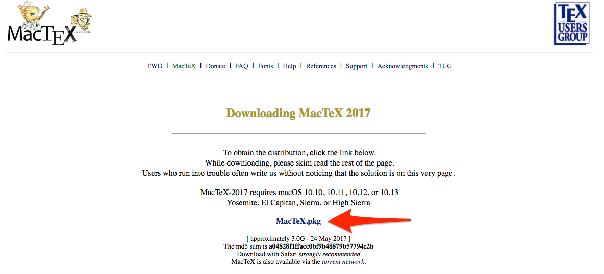
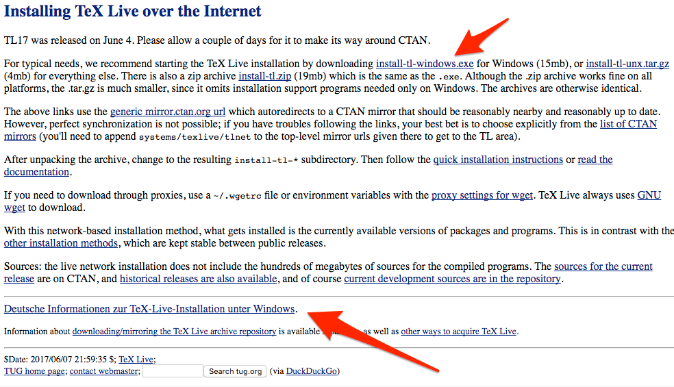

## LaTeX installieren

Bedienung dieser Diashow

- Steuerungselemente: 
  - Pfeile rechts unten und 
  - <i class="fa fa-bars"></i> Menü unten links
- Folienstruktur-Überblick: ESC-Taste
- Zoomen: ALT + (STRG für LINUX) KLICK in das Objekt. Noch ein Klick: Herauszoomen.
- Beenden: Mit dem Browser zurück gehen (nicht mit Pfeil rechts unten)

---

## Voraussetzungen

Bevor wir komfortabel mit R arbeiten können, müssen wir einige Programme installieren

1. Die aktuelle Version von [R](https://cran.r-project.org/)
2. Die aktuelle Version der Entwicklungsumgebung [RStudio](https://www.rstudio.com/products/rstudio/download/)
3. Die aktuelle Version von [LaTeX](https://www.latex-project.org/get/)

Alle Programme sind [Open Source](http://praxistipps.chip.de/open-source-was-ist-das-genau_12877): Sowohl Quellcode als auch Programme sind frei und kostenlos erhältlich.

---

<section data-markdown>
  <textarea data-template>
  ## LaTeX-Installation für Mac (1)
    .
    ---
    ## LaTeX-Installation für Mac (2)
    
    ---
    ## LaTeX-Installation für Mac (3)
    
  </textarea>
</section>

---

- For Mac press down keys
- For Windows press right key

<section data-markdown>
  <textarea data-template>
    ## LaTeX-Installation für Mac (1)
    .
    ---
    ## LaTeX-Installation für Mac (2)
    
    ---
    ## LaTeX-Installation für Mac (3)
    
  </textarea>

</section>

## LaTeX-Installation für Mac (1)

___

## LaTeX-Installation für Mac (2)

___

## LaTeX-Installation für Mac (3)

---

## LaTeX-Installation für Windows (1)

___

## LaTeX-Installation für Windows (2)

___

## LaTeX-Installation für Windows (3)

___

## Präsentation beenden

- Sie beenden nun diese Präsentation mit (**Browser** Pfeil rückwärts)
- ACHTUNG: Browser rückwärts -- und nicht Folien Pfeil links!

