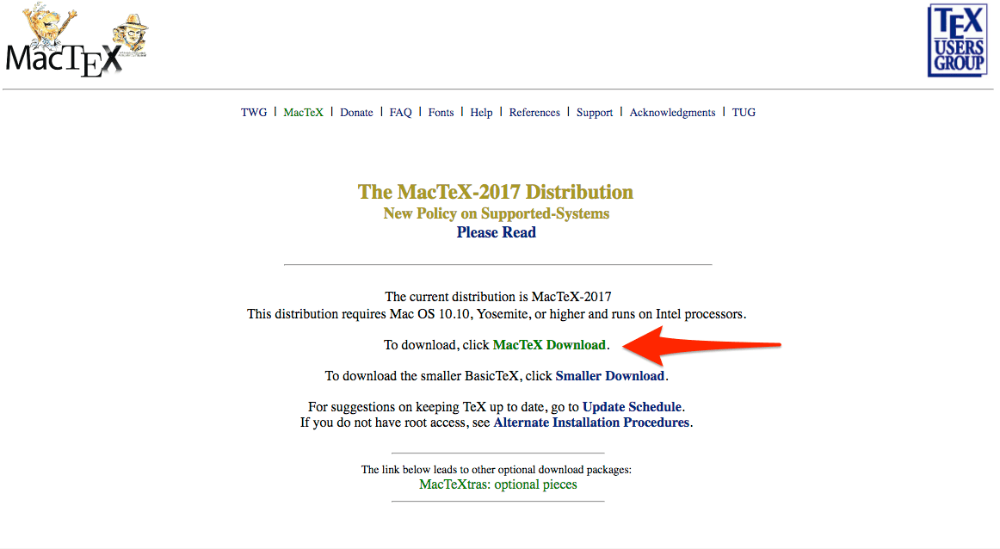

# Slide Features

Revealjs Demo | [Documentation](https://revealjs.com/) 

See also: [Wowchemy](https://wowchemy.com/docs/content/slides/) & 

[R Markdown: The Definitive Guide](https://bookdown.org/yihui/rmarkdown/revealjs.html)

---

## Features

- Efficiently write slides in Markdown
- 3-in-1: Create, Present, and Publish your slides
- Supports speaker notes
- Mobile friendly slides

---

## Controls

- Next: `Right Arrow` or `Space`
- Previous: `Left Arrow`
- Jump to slide with menue: <i class="fa fa-bars"></i>
- Start: `Home`
- Finish: `End`
- Overview: `Esc`
- Zoom: `Alt + Click`, Linux: `CTRL + Click`
- Speaker notes: `S`
- Fullscreen: `F`
- Pause presentation: `B` or `.`

---

## PDF Export

- Add "?print-pdf" to the end of the URL
- For example for this demo:

`https://notes.peter-baumgartner.net/slides/2022-04-18-demo-slides/?print-pdf`

- Open the in-browser print dialog (CTRL/CMD+P)
- Save to PDF
- See also: [PDF Export Documentation](https://revealjs.com/pdf-export/)
---


## Code Highlighting

Inline code: `variable`

Code block:
```r
porridge <-  "blueberry"
if (porridge == "blueberry"){
    print("Eating...")
    }
```

---

## Math

In-line math: $x + y = z$

Block math:

$$
f\left( x \right) = \;\frac{{2\left( {x + 4} \right)\left( {x - 4} \right)}}{{\left( {x + 4} \right)\left( {x + 1} \right)}}
$$

---
<section data-auto-animate>
  <h1>Auto-Animate</h1>
</section>
<section data-auto-animate>
  <h1 style="margin-top: 100px; color: red;">Auto-Animate</h1>
</section>

---

## Fragments

Make content appear incrementally

```
{} One {}
{} **Two** {}
{} Three {}
```

Press `Space` to play!

{} One {}
{} **Two** {}
{} Three {}

---

A fragment can accept two optional parameters:

- `class`: use a custom style (requires definition in custom CSS)
- `weight`: sets the order in which a fragment appears

---

## Speaker Notes

Add speaker notes to your presentation

```markdown
{}
- Only the speaker can read these notes
- Press `S` key to view
{}
```

Press the `S` key to view the speaker notes!


- Only the speaker can read these notes
- Press `S` key to view


---

## Themes

- black: Black background, white text, blue links (default)
- white: White background, black text, blue links
- league: Gray background, white text, blue links
- beige: Beige background, dark text, brown links
- sky: Blue background, thin dark text, blue links

---

- night: Black background, thick white text, orange links
- serif: Cappuccino background, gray text, brown links
- simple: White background, black text, blue links
- solarized: Cream-colored background, dark green text, blue links

---



## Custom Slide

Customize the slide style and background

```markdown



```

---

## Custom CSS Example

Let's make headers navy colored.

Create `assets/css/reveal_custom.css` with:

```css
.reveal section h1,
.reveal section h2,
.reveal section h3 {
  color: navy;
}
```

---
## Up/Down or Left/Right?

(My add on)

With the next slides you can choose:

- Down: Windows installation
- Right & then down: macOS installation 
---
<section data-markdown>
  <textarea data-template>
  ## LaTeX-Installation Windows (1)
    
    ---
    ## LaTeX-Installation Windows (2)
    
    ---
    ## LaTeX-Installation Windows (3)
    
  </textarea>
</section>

---

<section data-markdown>
  <textarea data-template>
  ## LaTeX-Installation macOS (1)
    .
    ---
    ## LaTeX-Installation macOS (2)
    
    ---
    ## LaTeX-Installation macOS (3)
    
  </textarea>
</section>

---
## Vertical slides

```markdown
<section data-markdown>
  <textarea data-template>
  ## LaTeX-Installation macOS (1)
    .
    ---
    ## LaTeX-Installation macOS (2)
    
    ---
    ## LaTeX-Installation macOS (3)
    
  </textarea>
</section>

See also: 
```
---

# Questions?

[Ask](https://github.com/wowchemy/wowchemy-hugo-modules/discussions)

[Documentation](https://wowchemy.com/docs/managing-content/#create-slides)

---
## Close presentation

Press back button of your browser.

(not back button of the slide!).
